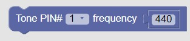

Welcome to our web-based educational block-based programming environment for Arduino! This tool is designed to introduce K-12 students to the world of programming and electronics using the popular Arduino platform BlocklyDuino. Below are instructions on how to start the tool and an overview of its features:

## Getting Started:

1. Ensure you have a compatible web browser installed (Google Chrome, Mozilla Firefox, etc.).
2. Run this comment on terminal: python arduino_web_server.py so you can run a mini webserver that uses the Arduino IDE.
3. Navigate to http://127.0.0.1:8080/ on browser.
4. Start exploring.

### Arduino Setup
* Before you start coding keep in mind the arduino should be setup as following:
*   ArduRookies Maze :
*   ArduRookies Music: Make sure that the Blue button is connected to digital pin 7, Red Button to digital pin 8 and White button to digital pin 9. The piezo buzzer should have it's positive pin connected to digital pin 4. In the end your setups should look like this:

### Features

* Web-based educational block-based programming environment
* Programming Arduino with visually drag and drop code blocks
* Different sounds for different blocks as Interaction Technique(Everytime a block is placed on the workspace, a sound is played(click.mp3). A different sound is played for the following block: ) (sound1.wav). It is clear to us how to add different sounds to each block but we still have to implement this for each particular block in the following days.
* Generate fully compatible Arduino source code
* Upload code to Arduino board 
* High contrast, block and text dimensions as UI Technique for color blind children
* Additional dialogs for use cases.

### Usage
1. Open browser to BlocklyDuino, drag and drop blocks to make an Arduino program
2. Select the Arduino tab and press the Upload button. (press the Reset button to upload an empty program)
